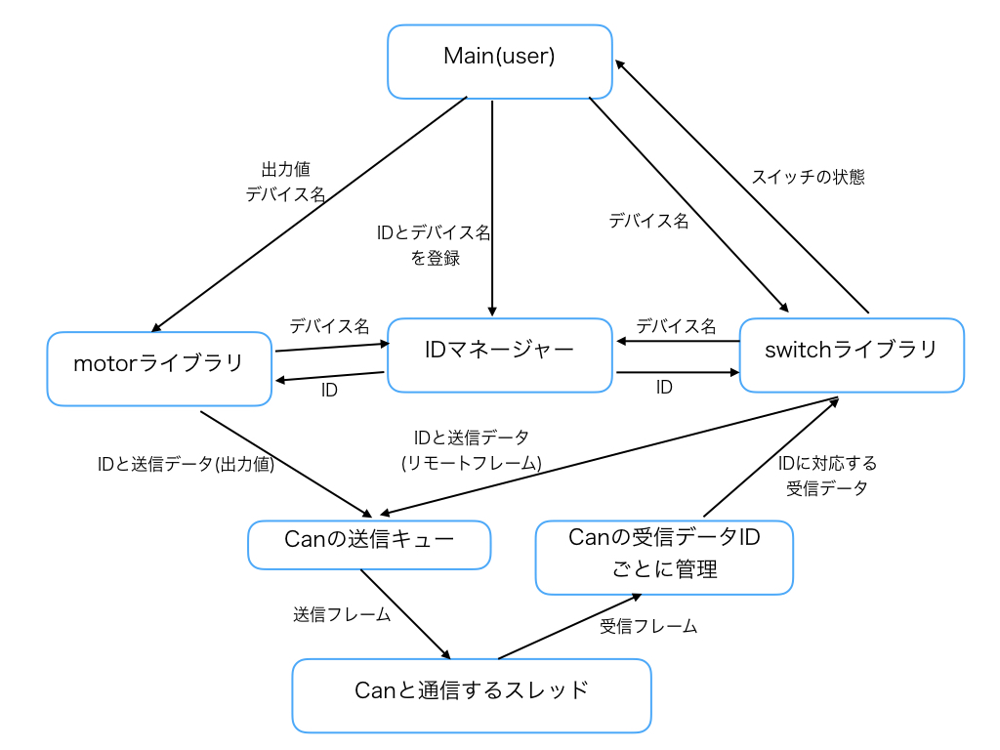

# Can communication library
Can用の通信ライブラリ。  
構造は下図のようになっている。  


ユーザーはあらかじめ、IDに対応するデバイス名を決めることができる。これにより、モータを指定するときに、IDではなくデバイス名を指定すればよくなる。  

# IDマネージャー
IDに対応するデバイス名を管理している。ユーザはこのライブラリにIDに対応するデバイス名を登録することで、それ以後、IDではなくデバイス名を指定することが可能になる。

# motorライブラリ
デバイス名をIDに変換し、出力値を送信データに変換して、送信キューにプッシュする。

# switchライブラリ
デバイス名をIDに変換し、送信キューにCANのリモートフレーム(スイッチに対しての送信要求のデータ)をセットする。その後、受信するまで待機し、受信した値をbool値で返す。

# CAN送信キュー
送信データをキューで管理している。  
Queueについて<http://www.cc.kyoto-su.ac.jp/~yamada/ap/queue.html>

# Example
```c++
#include "comm_lib/comm_device/comm_device.hpp"

int main(void)
{
    comm_device::IdManager::set_id("flont_motor", 0x51);
    comm_device::IdManager::set_id("right_switch", 0x24);

    // ID 0x51のモータドライバを生成
    comm_device::DCMotor front("flont_motor");

    // ID 0x24のスイッチドライバを生成。スイッチの番号は0。
    comm_device::Switch right_sw("right_switch", 0);

    if(right_sw.get_status())
    {
        //押されたとき
        front.set_power(50);    //前に50%で回転
    }else{
        front.set_power(-50);   //後ろにに50%で回転
    }
}
```